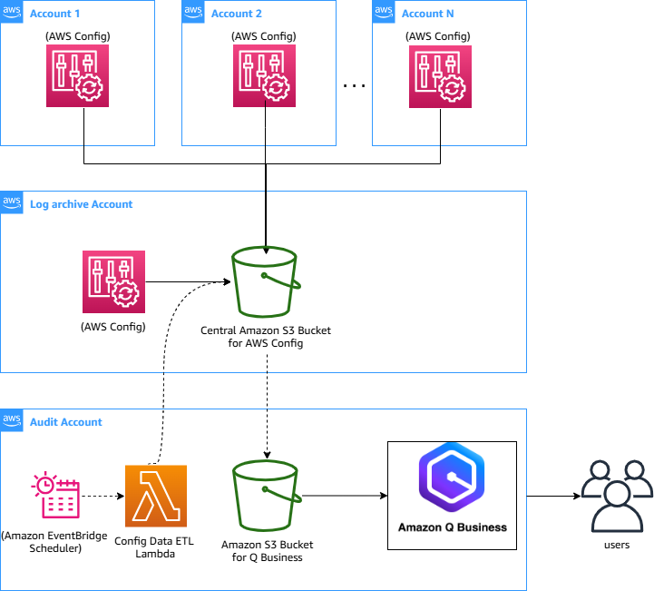
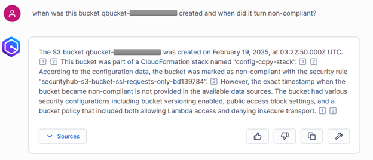
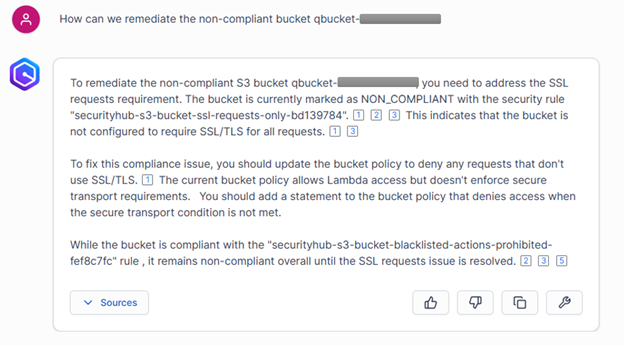

# Gain Compliance Insights in your AWS Environment Using Amazon Q Business

Enterprise organizations managing multiple AWS accounts face complexity as their cloud infrastructure scales. The exponential growth in resources, coupled with diverse configuration requirements across different business units, creates significant challenges in maintaining effective oversight of AWS environments.

AWS Config is a service that continually assesses, audits, and evaluates the configurations and relationships of your resources on AWS, on premises, and on other clouds. The AWS Config data is stored in secure Amazon S3 buckets.
When combined with the natural language processing capabilities of Amazon Q Business, this AWS Config data can used analyze AWS resource configurations, gaining insights and taking actions.

In this blog post, we will show how security and compliance teams can now use AWS Config and Amazon Q Business to gain deep visibility into their AWS environment. By leveraging natural language queries, teams can access critical compliance insights and proactively identify potential risks and identify remediation actions.

------------------------------------------------------------------------

## Overview of the Solution

Our solution addresses this challenge by integrating AWS Config, Amazon S3, and Amazon Q Business to create a natural language-powered interface for querying AWS resource configurations. Here’s how it works:

1.  **Extract relevant AWS Config Data** : Our solution periodically extracts the AWS Config data from a central Amazon S3 Bucket and copies it to a secure S3 bucket in an audit account. This is done for a list of selected AWS Accounts and Regions.

2.  **Process the Data with Amazon Q Business**: We will then configure Q Business to parse the AWS Config data stored in the secure S3 bucket in your audit account and create a knowledge base that can be queried using natural language.

3.  **Query the Knowledge Base with Natural Language**: With the knowledge base created by Q Business, users can now ask natural language questions about their AWS environment, such as “Which EC2 instances are running in my us-west-2 account?” or “What is the configuration of my RDS database in my development environment?”. Q Business will then provide the relevant information from the underlying AWS Config data.

By implementing this solution, your security team members can easily access and understand the configuration of your AWS resources, their compliance status and identify remediation actions using simple natural language questions.
## The Solution Architecture



## Prerequisites

security and compliance teams. The log archive account contains a central Amazon S3 bucket for storing a copy of all logs including AWS CloudTrail and AWS Config log files for all other accounts in your AWS Organization.

The audit account should be restricted to security and compliance teams with auditor (read-only) and administrator (full-access) cross-account roles to all accounts in the AWS Organization. These roles are intended to be used by security and compliance teams to perform audits through AWS mechanisms.

This solution is designed to be deployed in an audit account which can provide an isolated environment to host the required AWS Config data required for Amazon Q Business. We recommend that you deploy this solution in an audit account which is separate from the central log archive account.

Before we dive into the solution, let’s look at the prerequisites that are required to get started:

1. Necessary AWS Identity and Access Management (IAM) access in the log archive and audit account where this solution will be deployed.
2. Access to the AWS Console of the audit account
3. AWS CLI to deploy the necessary artifacts using AWS CloudFormation
4. SAM CLI – Install the SAM CLI. The Serverless Application Model Command Line Interface (SAM CLI) is an extension of the AWS CLI that adds functionality for building and testing Lambda applications.
5. Set up Q Business with the required permissions .
6. Configure an IAM Identity Center instance for an Amazon Q Business application to enable managing end user access to your Amazon Q Business application.

## How to build and Deploy the Solution

### Step 1: Deploy a ConfigDataReadRole IAM role in the log account which hosts the Central S3 bucket for AWS Config.

Using AWS CLI on the log account, create the ConfigDataReadRole role
with the trust policy. Ensure to replace the Principal to AWS account id of your audit account.

```bash

cat << 'EOF' > trust-policy.json
{
    "Version": "2012-10-17",
    "Statement": [
        {
            "Effect": "Allow",
            "Principal": {
                "AWS": "arn:aws:iam::1234567890:root"
            },
            "Action": "sts:AssumeRole",
            "Condition": {}
        }
    ]
}
EOF
```
```bash
aws iam create-role \
    --role-name ConfigDataReadRole \
    --assume-role-policy-document file://trust-policy.json

aws iam attach-role-policy \
    --role-name ConfigDataReadRole \
    --policy-arn arn:aws:iam::aws:policy/AmazonS3ReadOnlyAccess


```

### Step 2: Deploy the solution in the audit account

Using AWS CLI on the audit account, deploy the solution.

```bash
git clone https://github.com/aws-samples/sample-Compliance-Insights-Using-Amazon-Q
cd sample-Compliance-Insights-using-Amazon-Q
sam deploy ---guided ---capabilities CAPABILITY_NAMED_IAM

```
**SAM Deployment parameters:**\
**Stack Name:** Name of the deployed AWS CloudFormation stack.

Eg: Stack Name : config-copy-stack

**AWS Region:** AWS Region where the stack will be deployed.

Eg: AWS Region : us-east-1

**Parameter SourceBucketArn**: Bucket ARN for Central AWS Config S3
Bucket in the Log account.

Eg: Parameter SourceBucketArn :
arn:aws:s3:::aws-controltower-logs-0987654321-us-east-1

**Parameter AccountList**: Provide a comma separated AWS account numbers
whose AWS config data will be extract into audit account.\
Eg: Parameter AccountList: 9999999999,8888888888

**Parameter RegionList :** Provide a comma separate list of AWS regions,
whose AWS Config data will be extracted into the audit account.

Eg: Parameter RegionList : us-east-1,eu-west-1

**Parameter SourceAccountId**: Provide the account id of the AWS
logarchive account in your organization where is the source of AWS
Config logs.\
Parameter SourceAccountId : 0987654321

After the SAM deployment completes, run the following SAM command and capture the OutputValue of OutputKey - DestinationBucketName. This S3 Bucket name will be used as a parameter when deploying the Q Business CloudFormation Template in Step 3.

sam list stack-outputs --stack-name config-copy-stack --output table

### Step 3: Deploy and Configure Q Business

Amazon Q Business is a service that allows you to build intelligent
search and analytics applications on top of your business data. In this
example, we\'ll be using Q Business to analyze compliance-related data
stored in an S3 bucket.\
The [CloudFormation template attached](QBusiness.yml) in this solution created the following
resources:

1.  **Q Business Application**: The main application that will host our
    compliance analysis experience.

2.  **Q Business Index**: An index that the application will use to
    quickly search and retrieve relevant data.

3.  **Q Business Retriever**: Connects the application to the index,
    enabling search and retrieval functionality.

4.  **Q Business Data Source**: Configures an S3 bucket as the data
    source for the application. The S3 data source will be set to sync
    job to run at 8 AM every Monday in the UTC timezone.

5.  **Q Business Web Experience**: Provides a custom web interface for
    interacting with the Q Business application.

6.  **IAM Roles and Policies**: Grants the necessary permissions for the
    Q Business resources to access the S3 bucket and perform actions
    within the application.

Let\'s dive into the steps to deploy this solution.

**Deploy and Configure Q Business using a CloudFormation**

1.  Log in to the AWS Management Console and navigate to the
    CloudFormation service.

2.  Click \"Create stack\" and choose \"With new resources (standard)\".

3.  Select \"Upload a template file\" and choose the CloudFormation
    template you\'ve been provided.

4.  Fill in the required parameters:

    - **QBusinessApplicationName**: The name for your Amazon Q Business
      application.

    - **S3BucketName**: The name of the S3 bucket containing your
      compliance data which was captured earlier.

    - **UseIDC**: Set to \"true\" if you want to use AWS IAM Identity
      Center for user authentication.

    - **UseIdP**: Set to \"true\" if you want to use an external
      Identity Provider (IdP) for user authentication.

    - **IdentityCenterArn**: The ARN of your IAM Identity Center
      instance (required if UseIDC is \"true\").

    - **ExternalIdPArn**: The ARN of your external IdP (required if
      UseIdP is \"true\").

<!-- -->

1.  Review the template and its parameters, then click \"Next\" to
    proceed.

2.  On the next page, configure any additional stack options as needed,
    then click \"Next\".

3.  Review the stack details and acknowledge any necessary capabilities,
    then click \"Create stack\" to deploy the resources.

The CloudFormation deployment should take a few minutes to complete.
Once the stack is in the \"CREATE_COMPLETE\" state, you can move on to
the next steps.

**Step 4: Assign Users and Groups**

After the CloudFormation deployment, you\'ll need to manually assign
users and groups to the Q Business application. Here\'s how:

1.  In the AWS Console, navigate to the Amazon Q Business service.

2.  Click on the application name created by the template.

3.  In the \"User Access\" section, click \"Manage user access\".

4.  Click \"Add groups and users\", then select either \"Add and assign
    new users\" or \"Assign existing users and groups\" option.

5.  Provide the group/user name

6.  Select the group and click \"Assign\".

7.  Choose the appropriate subscription tier (e.g., Q Business Pro).

8.  Click \"Confirm\" to complete the assignment.

**Accessing the Q Business Web Experience**

After assigning users and groups, you can access the custom web
experience for your Q Business application. The CloudFormation template
outputs the URL for the web experience, which you can use to access the
application.\
The web experience provides a user-friendly interface for searching,
browsing, and interacting with the compliance data stored in your S3
bucket.

### Step 4: Test the solution

In order to test the solution, we will log in Amazon Q Business App
using login credentials. And interact using below questions:

1.  List all the non-compliant S3 buckets


2.  When was the bucket "name of the bucket" created and when did it
    turn non-compliant



3.  How can we remediate the non-compliant bucket "name of the bucket"



### Clean Up
Delete the config-copy-stack application that you created, use the SAM CLI.
sam delete
Remove the S3 read-only role in the log account.
aws iam delete-role \
--role-name ConfigDataReadRole

Delete Users and Groups in the Audit Account.
Locate and delete the stack created by the CloudFormation template deployment

### Conclusion

By integrating AWS Config and Amazon Q Business, you can unlock the power of natural language processing to gain valuable insights into your AWS environment. This solution empowers your team members to easily access and understand the configuration of their AWS resources. As your cloud infrastructure evolves, this solution can help you stay on top of your resource configurations and make informed decisions to optimize your AWS environment.
